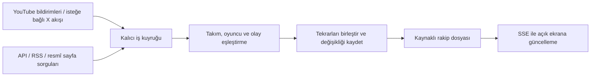

# Avrupa ligleri, Türkiye ve UEFA — veri kaynakları ve sürekli takip

Araştırma tarihi: 8 Eylül 2026. Kapsam: seçilen takımın yaklaşan rakibindeki gelişmelerin maç öncesi takibi. İlk kaynak incelemesi Süper Lig için yapıldı; ürün kapsamı daha sonra altı Avrupa ligi, Türkiye ve UEFA kulüp maçlarına genişletildi. Aşağıdaki Süper Lig doğrulamaları diğer liglerin alan kapsamını veya kaynak kalitesini doğrulamaz.

Bu belge sağlayıcı dokümanlarını, bir doğrudan RSS erişim testini ve önerilen uygulama tasarımını ayırır. Ücretli hesap açılmadı, abonelik alınmadı, sürekli çalışan bir dinleyici kurulmadı. Fiyatlar araştırma günündeki yayımlanmış liste fiyatlarıdır.

## Sonuç ve öneri

Ana içerik kulüp açıklamaları, TFF kararları ve kaynaklı haberlerden gelmeli. Fikstür API'si hangi rakibe bakılacağını belirler; sakatlık ve kadro verisi dosyayı destekler. Canlı skor tek başına antrenman, açıklama veya kulüp gündemini karşılamaz.

Ücretsiz başlangıç için resmî web kaynakları + doğrulanmış RSS + YouTube bildirimleri öneriliyor. API-Football ücretsiz planı, güncel Süper Lig sezonuna erişimi gerçekten sağlıyorsa fikstür desteği için aday. Bu erişim doğrulanmadan ücretsiz güncel sezon desteği vaat edilmeyecek.

Kullanıcı yapılandırılmış sakatlık verisi için dört saatlik sıklığı yeterli buldu. Hız yatırımı öncelikle haberlerin ilk yayınına erişime ve kullanıcıya teslimine yönelmeli. Fikstür/kapsam veya kota ihtiyacı oluşursa API-Football Pro ilk ücretli aday; Sportmonks alternatif. Süper Lig'in tüm haber ve kadro gelişmelerini ücretsiz, eksiksiz ve saniyeler içinde sunan bir servis bu araştırmada doğrulanamadı.

## Yapılandırılmış futbol servisleri

### Genişleyen kapsamın sağlayıcı seçimine etkisi

Onaylanan liste: İngiltere, İspanya, Almanya, İtalya, Fransa, Portekiz ve Türkiye'nin üst ligleri. Kullanıcı altıncı Avrupa ligi olarak Portekiz'i seçti. Buna Şampiyonlar Ligi, Avrupa Ligi ve Konferans Ligi eklenir; ön elemeler ve play-off'lar da izlenir. UEFA bu üç organizasyonu kulüp müsabakaları kapsamında listeliyor. [UEFA kulüp organizasyonları](https://www.uefa.com/running-competitions/our-competitions/clubs/)

Yedi ulusal lig + üç UEFA kupası, ürün düzeyinde en az on organizasyon anlamına gelir. Sağlayıcının eleme aşamalarını aynı organizasyonda mı ayrı kimliklerde mi tuttuğu API ile doğrulanmalı. Tek bir Süper Lig pilotunun maliyeti bu kapsama genellenemez.

Sportmonks'un beş lig seçmeli 29 EUR Starter paketi bu listenin tamamı için yeterli kabul edilemez. Yayımlanmış Growth planı aylık ödemede 99 EUR ve 30 lig seçimi sunuyor; tam kapsam için karşılaştırılacak standart paket budur, özel paket fiyatı ayrıca değerlendirilebilir. Satın alma kararı verilmedi. [Güncel paketler](https://www.sportmonks.com/football-api/plans-pricing/)

API-Football ilk aday olmaya devam ediyor; ancak her organizasyon/sezon için fikstür, takım, eksikler ve maç kadrosu desteği ayrı test edilecek. Kapsama listesinde adın bulunması bütün alanların her maçta dolu olduğu anlamına gelmez. [Kapsam listesi](https://www.api-football.com/coverage)

football-data.org bazı Avrupa liglerinde yardımcı kaynak olarak yeniden değerlendirilebilir; aşağıdaki Süper Lig eksikliği tek başına ana sağlayıcı olmasını engellemeye devam ediyor. Farklı sağlayıcıların kimliklerini eşleştirmenin maliyeti, ücretsiz çağrı tasarrufuyla birlikte değerlendirilir.

Kaynak matrisi organizasyon × sezon × takım × dil düzeyinde tutulacak. UEFA'da bu yedi lig dışından gelen bir rakip de takip kapsamına alınacak. Yeni rakip belirlenince resmî site ve yerel haber kaynakları erkenden keşfedilecek; yalnızca İngilizce haber toplayarak yerel ilk yayının hızı varsayılmayacak. Henüz Avrupa kulüplerinin haber kaynaklarında erişim ve gecikme testi yapılmadı.

| Servis | Ücretsiz kullanım / fiyat | Süper Lig durumu | Canlılık ve kullanım kararı |
|---|---|---|---|
| API-Football / API-SPORTS | Ücretsiz 100 istek/gün; Pro 19 USD/ay, 7.500 istek/gün | Kapsama listesinde var. Ücretsiz planda sezon sınırlaması var. | REST sorgulaması. Fikstür, kadro, eksikler ve maç olayları için ilk aday. Güncel sezon ve alan kapsamı hesapla test edilmeli. |
| Sportmonks | Ücretsiz ligler Danimarka ve İskoçya; Starter aylık ödemede 29 EUR/ay, seçilen 5 lig, varlık başına saatte 2.000 çağrı | Ücretli planlarda seçilebilir | Dokümanda yalnızca pull mekanizması belirtiliyor. Süper Lig için kalıcı ücretsiz seçenek değil. |
| football-data.org | Ücretsiz 12 organizasyon, 10 çağrı/dakika; skorlar gecikmeli | Ücretsiz kapsam listesinde Süper Lig yok | İlk sürümün Süper Lig kaynağı olarak elendi. |
| TheSportsDB | Ücretsiz V1; Premium 9 USD/ay | Süper Lig sayfası mevcut, lig kimliği 4339 | Takım/lig bilgisi için aday. Canlı skor Premium kapsamında, yayımlanan açıklama 2 dakikalık skor güncellemesi belirtiyor. Güncel fikstür eksiksizliği API ile doğrulanmadı. |
| Sportradar Soccer | Sürekli ücretsiz üretim planı doğrulanmadı; Push, Realtime müşterilerine ek hizmet | Seçilecek paket için Süper Lig kapsamı ayrıca doğrulanmalı | Gerçek HTTP akışı var. Standart kendi kendine açılan denemeye Push dahil değil. İleri aşama seçeneği. |

Kaynaklar: [API-Football fiyatları](https://www.api-football.com/pricing), [lig kapsamı](https://www.api-football.com/coverage); [Sportmonks ücretsiz plan](https://www.sportmonks.com/football-api/free-plan/), [fiyatlar](https://www.sportmonks.com/football-api/plans-pricing/), [Süper Lig SSS](https://www.sportmonks.com/faq/), [pull mekanizması](https://docs.sportmonks.com/v3/faq/integration); [football-data.org kapsam](https://www.football-data.org/coverage), [fiyatlar](https://www.football-data.org/pricing); [TheSportsDB API](https://www.thesportsdb.com/docs_api), [API rehberi](https://www.thesportsdb.com/docs_api_guide), [Süper Lig](https://www.thesportsdb.com/season/4339-turkish-super-lig/2025-2026); [Sportradar Soccer Push](https://developer.sportradar.com/soccer/docs/soccer-ig-push).

API-Football rehberine göre sakatlık verisi dört saatte bir yenileniyor. Sık sorgu bu kaynağın daha erken bilgi üretmesini sağlamaz. Canlı fikstür/olay sorguları için 15–60 saniye aralıkları öneriliyor; kadro verisinin yayımlanma zamanı organizasyona göre değişiyor. Lig-sezon yanıtındaki `coverage.injuries` gibi kapsam alanları kontrol edilmeli. Rehberde belirtilen süreler, Süper Lig için tarafımızdan ölçülmüş gecikme garantisi değildir. [Sağlayıcı rehberi](https://www.api-football.com/news/post/how-to-get-started-with-api-football-the-complete-beginners-guide)

## Haberler ve doğrudan kaynaklar

| Kaynak | Sağladığı değer | Erişim / takip | Sınırlama |
|---|---|---|---|
| TFF | Fikstür değişiklikleri, disiplin kararları, Tahkim ve görevlendirmeler | Resmî haber/karar sayfalarının değişiklik takibi | Bu araştırmada kamuya açık belgelenmiş API veya webhook doğrulanmadı. Disipline sevk ile kesinleşmiş cezayı ayrı olay türlerinde tut. |
| Kulüp siteleri | Sağlık raporu, antrenman, kamp kadrosu, açıklama ve transfer | Her kulübün futbol haberleri; varsa kendi RSS'i | Her kulüp için kaynak keşfi ve erişim kontrolü gerekiyor. Haber içeriğinden kesin oynama kararı uydurulmaz. |
| TRT Haber Spor RSS | Türkçe spor haberleri, doğrudan haber bağlantıları | Ücretsiz erişilen RSS'i sorgulama | Futbol dışı içerikler de var. Tek başına Süper Lig kapsamı veya hızlı yayın garantisi sağlamıyor. |
| Anadolu Ajansı | Haber keşfi için ek aday | Resmî sitede RSS bağlantısı var | Spor kategorisi akışı ve içerik kullanım kapsamı bu araştırmada doğrulanmadı; etkin kaynak sayılmamalı. |
| YouTube kulüp kanalları | Yeni video, başlık ve açıklama değişiklikleri; basın toplantısı keşfi | PubSubHubbub / WebSub ile sunucuya HTTP bildirimleri | Bu bildirim konuşma metni veya canlı yayın ses dökümü sağlamaz. Video içeriğindeki açıklamaları çıkarmak ayrı entegrasyon gerektirir. |
| GDELT | Daha geniş haber keşfi ve yabancı kaynak taraması | Ücretsiz açık veri; DOC API ile başlık/bağlantı arama | GDELT 2.0 akışlarında 15 dakikalık güncelleme döngüsü var. DOC sorgusunun en küçük zaman penceresi 15 dakika; bu bir teslimat garantisi değil. Türkçe spor kapsamı ayrıca ölçülmeli. |
| X Filtered Stream | Seçilen kulüp ve muhabir hesaplarının yeni paylaşımları | Kalıcı HTTP bağlantısından yakın gerçek zamanlı akış | Kullanıma göre ücretli. Fiyatlar Developer Console'dan doğrulanmalı; ücretsiz temel plana dahil edilmemeli. |
| NewsAPI | Haber arama | Ücretsiz geliştirme planında 100 istek/gün | 24 saat gecikme ve yalnızca geliştirme/test kullanımı nedeniyle canlı üretim ihtiyacına uygun değil. |

Kaynaklar: [TFF haberleri](https://www.tff.org/Default.aspx?pageId=937), [PFDK](https://www.tff.org/default.aspx?pageID=246), [Süper Lig](https://www.tff.org/default.aspx?pageID=80); [kulüp sağlık raporu örneği](https://www.galatasaray.org/haber/futbol/acibadem-saglik-raporu/acibadem-saglik-raporu/59333); [TRT resmî RSS listesi](https://www.trthaber.com/sitene_ekle.html); [AA ana sayfa ve RSS bağlantısı](https://www.aa.com.tr/tr/); [YouTube bildirim dokümanı](https://developers.google.com/youtube/v3/guides/push_notifications); [GDELT veri yapısı](https://www.gdeltproject.org/data.html), [DOC API](https://blog.gdeltproject.org/gdelt-doc-2-0-api-debuts/); [X stream](https://docs.x.com/x-api/posts/filtered-stream/introduction), [X ücretlendirme](https://docs.x.com/x-api/fundamentals/post-cap); [NewsAPI fiyat/kullanım sınırları](https://newsapi.org/pricing).

TRT Spor ile TRT Haber farklı kaynaklardır. Doğrulanan akış TRT Haber Spor'dur. Tarayıcıda çalışan bir haber sayfası, kendiliğinden RSS veya API desteği sayılmayacak. Belgelenmemiş site içi uç noktalar ürünün temel veri bağımlılığı yapılmayacak.

Kamuya açık okuma erişimi ile içerik yeniden yayımlama hakkı ayrı değerlendirilir. Başlangıçta kaynak bağlantısı ve izin verilen kısa özet/metadata kullanılmalı; tam metin veya görsel kopyalama varsayılmamalı. Otomatik web erişiminde kaynağın erişim koşulları ve hız sınırları kontrol edilmeli.

## Yapılan erişim testi

8 Eylül 2026 tarihinde `https://www.trthaber.com/spor_articles.rss` doğrudan GET ile kontrol edildi:

- HTTP 200; içerik türü `text/xml`; 90.548 bayt.
- Python XML ayrıştırıcısıyla geçerli `rss` kökü ve 60 `item` doğrulandı.
- Kanal adı: `TRT Haber Spor Haberleri`.
- İlk öğenin yayın zamanı: 7 Eylül 2026, 20:48 +03:00.
- Akışta futbol dışı sporlar da mevcut.

Bu test, erişim ve biçimi doğrular; haberlerin eksiksizliğini, sürekliliğini veya uçtan uca gecikmeyi doğrulamaz. API-Football, Sportmonks ve diğer anahtar isteyen servislerde hesaplı veri testi yapılmadı. TheSportsDB ve GDELT örnek uç noktaları web okuyucusuyla açılamadı; bu araç hatası servislerin çalışmadığı anlamına gelmez.

## Anlık takibin uygulama tasarımı

Kaynak tarafında bildirim/stream destekleniyorsa dinlenir. Desteklenmiyorsa veri belirli aralıklarla sorgulanır. Her iki yol aynı olay işleme hattına bağlanır. Sayfanın otomatik güncellenmesi ile kaynaktaki verinin güncelliği ayrı ölçülür.

Sunucudaki toplama işlemi, kullanıcının sayfayı açık tutmasına bağlı olmamalı. Aynı kaynağı her kullanıcı için ayrı sorgulamak yerine bir kez topla, ilgili rakip dosyalarına dağıt. Sürekli açık uygulama altyapısı, depolama ve özetleme maliyeti API ücretinden ayrıdır; ücretsiz veri, sıfır toplam işletim maliyeti demek değildir.

Önerilen ilk kontrol aralıkları aşağıdadır. Bunlar erişim koşullarına, kotaya ve ölçülen güncellenme hızına göre ayarlanacak ürün hedefleridir; sağlayıcı taahhüdü değildir.

| Veri | Önerilen başlangıç davranışı |
|---|---|
| Öncelikli kulüp/TFF haber sayfaları | Aktif rakip takibi boyunca, kaynak izinleri ve kapasitesi doğrulanırsa 30–60 saniyelik kontrol hedefi; uygun olmayan kaynakta desteklenen aralık kullanılır ve gecikme açıkça belirtilir |
| Öncelikli haber RSS | Kaynak izinleri, yayın döngüsü ve kapasite uygunsa 30–60 saniyelik kontrol hedefi; ETag / Last-Modified desteği varsa koşullu istek. RSS'in kaynağın kendisinden geç güncellenmesi ayrıca ölçülür |
| Fikstür | Normalde 6 saat; maça yaklaştıkça ve erteleme/program haberi geldiğinde daha sık |
| API-Football eksikler | Dört saatte bir; hızlı değişiklikler için kulüp haberleri ayrıca izlenir |
| Açıklanan maç kadrosu | Başlangıçtan 90 dakika önce kontrole başla; kota dahilinde 5–10 dakika; veri geldikten sonra seyrekleştir |
| Canlı maç olayları | Gerekli maç penceresinde ücretli kota ile 15–60 saniye; rakibin önceki maçında yeni gelişme yakalamak için yardımcı |
| YouTube | Bildirim aboneliği, süre yenileme ve kaçırılan güncellemeler için seyrek uzlaştırma |
| GDELT | Başlangıçta 15–30 dakika, örtüşen arama pencereleriyle tamamlayıcı keşif |

Olay kartı kaynak yayın zamanı, varsa olay zamanı, sistemin ilk gördüğü zaman ve son kaynak kontrolünü ayrı tutmalı. Kaynak eskiyse veya erişilemiyorsa bu durum görünür olmalı. Sessiz kaynak ile bozuk dinleyici birbirine karıştırılmamalı.

### İlk haberi geciktirmeyen gösterim

Haberi al → kaynak ve takım/branş eşleşmesini kontrol et → benzersiz kaydı kalıcı yaz → başlık, kaynak, bağlantı ve zamanla ilk kartı gönder. Özetleme, ayrıntılı sınıflandırma ve farklı kaynakların aynı olay altında birleştirilmesi arka planda kartı günceller. Basit kimlik/bağlantı tekrar kontrolü ilk gösterimden önce yapılır; belirsiz takım eşleşmeleri otomatik olarak ilgisiz kullanıcıya gönderilmez.

Bu yaklaşım yeni sağlık haberleri için de geçerlidir. Örneğin kulübün yeni açıklaması hemen kaynaklı haber kartı olur; yapılandırılmış sakatlık listesinin yenilenmesi beklenmez. Haberin iddia veya resmî açıklama oluşu baştan görünürdür; özetleme sırasında içerikte olmayan kesinlik eklenmez.

Önerilen mühendislik hedefi, sağlıklı bağlantılarda sisteme alınmış ve eşleştirilmiş haberlerin yüzde 95'ini açık istemcide beş saniye içinde göstermek. Bu henüz ölçülmemiş bir tasarım hedefidir; kaynağın yayımlama veya bildirim gecikmesini kapsamaz. Başlangıç ölçümü haberin sisteme ilk girişinden itibaren de tutulur; eşleştirme kuyruğundaki bekleme bu şekilde gizlenmez.

Üç süre ayrı izlenir: kaynak yayınından ilk alıma, ilk alımdan ekranda gösterime, kaynak yayınından ekranda gösterime. Kaynak zamanı güvenilir değilse ilk ve üçüncü süreler ölçülemiyor olarak işaretlenir. 30–60 saniyelik sorgu aralığı, haberi yayımdan itibaren kesinlikle 60 saniyede teslim etme garantisi değildir. Uygulama dışı push bildirimi ayrıca cihaz iznine ve teslimat koşullarına bağlıdır.

Önceki 2–5 dakikalık genel haber kontrol önerisi bu öncelikli kaynaklar için revize edildi. Daha yavaş kaynaklar tamamlayıcı keşif amacıyla tutulabilir. Bildirim/stream destekleyen doğrudan kaynaklar önceliklidir; ücretli erişim ihtiyacı, mevcut ücretsiz kaynakların ölçülen gecikmesiyle gerekçelendirilir.

Kalıcı kuyruk ve benzersiz olay kimlikleri yeniden denemelerde çift haber oluşmasını engeller. RSS için GUID/kanonik bağlantı ve içerik özeti; API için sağlayıcı kimliği ve veri sürümü kullanılabilir. Aynı haberin farklı sitelerdeki kopyaları bir olay altında tutulur, farklı kaynak bağlantıları korunur. Oyuncu adları takım/branş kimliğiyle eşleştirilir; örneğin basketbol sakatlığı futbol dosyasına düşmemeli.

Zaman aşımı, 429 ve bağlantı kopmasında artan bekleme, kotaya göre yavaşlama ve son başarılı konumdan tamamlama gerekir. Webhook tekrarları güvenli biçimde işlenmeli; SSE yeniden bağlantısında istemci kaçırdığı olayları son olay kimliğiyle alabilmeli. Tam bir kaynak kesintisinde son veriyi güncelmiş gibi göstermemeli.

## Ücretsiz kotanın hesabı

Bir uç noktayı 24 saat boyunca 15 saniyede bir sorgulamak 5.760 istek/gün; dakikada bir sorgulamak 1.440 istek/gün demektir. 100 istek/gün tüm güne eşit yayılsa tek uç nokta için ortalama 14,4 dakikada bir sorgudur. Dolayısıyla API-Football ücretsiz kotası kesintisiz saniyelik takip için yeterli değil.

Tek seçilmiş maç için örnek düşük kullanım günü: fikstür 4, eksikler 6, maç öncesi kadro kontrolü 12 çağrı = 22 çağrı. Lig/takım keşfi, ek uç noktalar, sayfalama ve yeniden denemeler buna eklenir. Bu örnek yalnızca güncel sezon erişimi ve uygun yanıt kapsamı doğrulanırsa uygulanabilir.

120 dakikalık bir maç penceresinde 15 saniyelik tek sorgu döngüsü 480 çağrıdır. İki ayrı uç nokta aynı sıklıkla çekilirse 960 olur. Takım/kullanıcı sayısıyla değil, benzersiz kaynak sorgularıyla ölçeklemek gerekir. Pro kotası rahatlık sağlar; dört saatlik sakatlık güncellemesini hızlandırmaz.

## Uygulamaya geçiş sırası

Yeni kapsam: Taraftar nabzı için sosyal medya artık araştırılacak ana veri kaynaklarından biri. X'te yalnızca muhabir/kurumsal hesap listesi toplamak taraftar görüşlerini ölçmeye yetmez; maç ve takım konuşmalarını da kapsayan örnekleme gerekir. X erişimi hâlâ ücretli ve hesapla doğrulanmadı. YouTube yorumları ek adaydır; video bildirimleri yorumları kapsamaz. Yöntem ve güncel resmî API kaynakları [SPORTS_FAN_PULSE.md](SPORTS_FAN_PULSE.md) içinde. Bu özellik için henüz veri toplama veya model doğrulaması yapılmadı.

1. İlk pilot takımı netleştir; onaylanan yedi ulusal lig ve UEFA katılımcı takım kimliklerini, isim varyantlarını organizasyonlar arasında eşleştir. Yedi lig dışından UEFA rakiplerini destekle.
2. Kaynak başına adres, dil, branş, yöntem, erişim durumu, kontrol aralığı, son başarı ve kapsam içeren kayıt oluştur. Kulüp, ilgili federasyon/lig, UEFA ve yerel muhabir kaynaklarını takım başına doğrula.
3. API-Football hesabında her organizasyon için güncel sezonu, yaklaşan fikstürleri ve eksik/kadro kapsamını test et. Ön eleme ve play-off kimliklerini doğrula. Örnekleri lig + Avrupa maçını aynı hafta oynayan bir takım ve yedi lig dışından bir rakiple genişlet.
4. Önce TRT RSS ve seçilen kulüp/TFF kaynaklarından veri toplayan küçük bir pilot kur; olayları kalıcı kaydet, tekrarları birleştir, ekrana SSE ile aktar.
5. YouTube bildirimlerini ekle. Videonun yayımlanmasını tespit etmek ile içeriğini anlamayı ayrı özellikler olarak ele al.
6. En az bir maç haftasında güncellik, kaçırılan gelişmeler, yanlış takım eşleşmeleri, tekrar oranı ve istek tüketimini ölç. Ücretli API ve X kararını ölçülen eksiklere göre ver.

Pilot kabul ölçütleri: kaynak/yorum ayrımı, kaynak kesintisinin görünmesi, aynı gelişmenin tekrar kart üretmemesi, bildirim veya sorgu sonrasında dosyanın otomatik yenilenmesi, bağlantı kesildikten sonra kaçırılan kayıtların tamamlanması. Gecikme hedefi ilk ölçümlerden sonra kaynak türüne göre belirlenecek.

## Oyuncu verisi araştırması: Opta, Football Manager ve açık alternatifler

Araştırma tarihi: 9 Eylül 2026. Soru: oyuncu düzeyinde detaylı analiz için Opta verisi alınabilir mi, Football Manager veri seti kullanılabilir mi, hangi açık kaynaklar var?

### Opta (Stats Perform)

- Halka açık fiyat veya ücretsiz katman yok; yalnızca kurumsal satış, kapsam (lig/ülke/veri seviyesi) bazlı özel teklif. Başvuru satış ekibi üzerinden yapılıyor. [Fiyat/lisans SSS](https://www.statsperform.com/stats-perform-faqs-pricing-and-licensing/), [API/teslimat SSS](https://www.statsperform.com/stats-perform-faqs-apis-and-data-delivery/)
- Ocak 2026'da Stats Perform, FBref'in Opta lisansını sonlandırdı ve gelişmiş istatistiklerin siteden kaldırılmasını istedi; ücretsiz Opta türevi verinin alanı daralıyor. [2026 kaynak durumu](https://www.liamhenshaw.com/writing/where-to-find-football-data)
- Karar: bu aşamada alınamaz varsayılacak. Sofascore/FotMob/WhoScored gibi Opta lisanslı yüzeylerin kazınması hem onların hem Opta'nın haklarını ihlal eder; yapılmayacak. Ölçek ve bütçe oluştuğunda doğrudan Stats Perform görüşmesi ayrı bir iş kalemidir.

### Football Manager veri seti

- SI'ın veri lisans sözleşmesi ("Data Supply Terms", Kasım 2024) alıcıyı açıkça "profesyonel bir futbol kulübünün yönetiminden sorumlu" kuruluş olarak tanımlıyor; sınırlı amaç, ücretli, yeniden dağıtım ve üçüncü taraf kullanımı yasak. Tüketici uygulaması bu kanaldan lisans alamaz. [Lisans metni](https://cdn.sports-interactive.com/site/2024-11/SI%20-%20FMDB%20Portal%20-%20Data%20Supply%20License%20Terms%20-%2015%20November%202024%20-%20JC%20(FINAL).pdf)
- SEGA hukuk, FM oyuncu niteliklerini yayımlayan toplulukları (ör. FMInside) kaldırtmış durumda; SI ayrıca kendi tüketici uygulamasını (FMdB Football Scout) çıkardı, yani bu veri onların ürünü. [FMInside duyurusu](https://fminside.net/news/739-player-database-attributes), [FMdB haberi](https://www.pcgamer.com/fmdb-mobile-app-brings-football-managers-full-database-to-your-pocket/)
- Karar: FM verisi (Kaggle kopyaları dahil) kullanılmayacak. "FM hissi" veren oyuncu profili, lisanslı istatistiklerden ürettiğimiz yapay zeka scout raporuyla sağlanacak; bu özgün içeriktir ve telif sorunu doğurmaz.

### Kullanılabilir kaynaklar

| Kaynak | Ne veriyor | Lisans/erişim | Karar |
|---|---|---|---|
| API-Football (mevcut anahtar) | Oyuncu sezon istatistikleri: maç/dakika, gol/asist, şut, pas isabeti, kilit pas, top kapma, ikili mücadele, çalım, faul, kart, penaltı, reyting; ayrıca sakatlık geçmişi, transfer geçmişi, kupalar | Ücretsiz 100 istek/gün; Pro 19 USD/ay 7.500 istek/gün | Oyuncu detay sayfasının ana kaynağı. Kadro zaten buradan geliyor; oyuncu kartına tıklayınca detay + AI scout raporu. xG alanı lig bazında tutarsız, vaat edilmeyecek. |
| StatsBomb Open Data | Ücretsiz maç-olay verisi (Dünya Kupaları, EURO'lar, seçili lig sezonları), JSON | GitHub'da açık; yayın halinde StatsBomb atfı ve logosu şart | Canlı Süper Lig verisi değil; radar/persentil metodolojimizi geliştirip doğrulamak için araştırma seti. [Repo](https://github.com/statsbomb/open-data) |
| Wikipedia/Wikidata | Oyuncu biyografisi, kariyer geçmişi, milli takım | Açık lisans (CC) | Oyuncu profilinde arka plan bilgisi için serbest zenginleştirme. |
| Understat | Büyük 5 lig xG | Resmî API yok, kazıma | Üründe kullanılmayacak; yalnızca dahili kıyas. |
| FBref | Tarihsel gelişmiş istatistik | Opta verisi kaldırıldı (Oca 2026), kazıma engelli | Kaynak olarak elendi. |
| TFF | Ceza/PFDK, tescil, TR oyuncu kayıtları | Kamu sayfaları, yapı eski (postback) | Künye doğrulaması için aday; otomasyon kırılgan, öncelik değil. |

### Önerilen yol: "Oyuncu dosyası" özelliği

1. Faz 1 (mevcut altyapıyla): kadro kartından oyuncu detayına geçiş. API-Football `players` + `sidelined` + `transfers` + `trophies` uçları; takım bazında önbellek (4-12 saat). Claude ile kullanıcının dilinde 2-3 paragraflık scout raporu: güçlü/zayıf yönler yalnızca eldeki istatistiklerden, uydurma nitelik puanı yok.
2. Faz 2: sezon istatistiklerinden lig içi persentil/radar hesapları (kendi hesabımız, StatsBomb açık verisiyle metodoloji doğrulaması).
3. Faz 3 (ölçek sonrası): Stats Perform/Opta veya Sportmonks üst paket görüşmesi; ancak ürün-pazar uyumu kanıtlanınca.

Maliyet notu: oyuncu detayına tıklama başına 1-3 API-Football isteği + önbellek ile ücretsiz plan başlangıç için yeterli; günlük aktif kullanım artarsa Pro (19 USD/ay) ilk yükseltme adımı.

